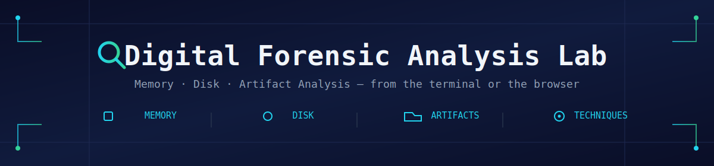

<div align="center">



<br/>


<p>A toolkit to <b>capture, analyze, and interpret digital forensic artifacts</b><br/>
from memory dumps, disk images, and system logs — usable from the terminal <i>or</i> the browser.</p>

</div>

> [!NOTE]
> Based on the [Digital Forensic Analysis Lab](https://github.com/aw-junaid/cybersec-projects/tree/main/Projects/Defensive/Digital%20forensic%20analysis%20lab) by [Abdul Wahab Junaid](https://github.com/aw-junaid), used under the MIT License. See [What I Changed](#-what-i-changed) for the fix contributed in this fork.

<br/>

## 📑 Table of Contents

- [What This Project Does](#-what-this-project-does)
- [Who This Is For](#-who-this-is-for)
- [What I Changed](#-what-i-changed)
- [How to Run](#-how-to-run)
- [Web UI](#-web-ui)
- [Algorithm Explanation](#-algorithm-explanation)
- [License](#-license)

---

## 🎯 What This Project Does

<table>
<tr>
<td width="33%" valign="top">

### 🧠 Memory Dumps
*Example: a RAM capture from a compromised computer*

- Running processes
- Suspicious malware processes
- Open network connections
- Hidden strings in memory

</td>
<td width="33%" valign="top">

### 💾 Disk Images
*Example: a forensic image of a hard drive*

- Files and folders
- File timestamps
- Deleted artifacts
- Registry information

</td>
<td width="33%" valign="top">

### 📁 Artifacts
*Example: traces left by users and apps*

- Browser history
- Log files
- Application data
- User activity traces

</td>
</tr>
</table>

**Output** — a structured JSON report:

```json
{
  "processes": [...],
  "network_connections": [...],
  "suspicious_artifacts": [...]
}
```

---

## 👥 Who This Is For

| Good fit | Why |
|---|---|
| 🎓 **Students** | Learn digital forensics, incident response, and DFIR workflows hands-on |
| 🔰 **Cybersecurity beginners** | Understand memory analysis and forensic evidence collection from working code |
| 🔬 **Researchers** | Experiment with and extend forensic techniques |

> [!WARNING]
> **Not recommended for:** real criminal investigations, court evidence, or enterprise forensic work. For those, professionals use purpose-built, legally-validated tools such as **Volatility**, **Autopsy**, **FTK Imager**, and **EnCase**.

---

## 🛠 What I Changed

While testing the memory analysis module on Windows, this error came up:

```
[-] Error extracting strings: '<=' not supported between instances of 'int' and 'bytes'
```

| | |
|---|---|
| **Root cause** | The original code iterated directly over an open `mmap` object byte-by-byte. On this Python/Windows combination, that iteration returned `bytes` objects instead of plain integers, so the printable-ASCII range check (`32 <= byte <= 126`) failed. |
| **Fix** | Read the full `mmap` buffer into a `bytes` object first (`data = mm.read()`), then iterate over that. Iterating over a real `bytes` object always yields plain integers regardless of platform, which resolves the crash. |

---

## ▶️ How to Run

**1. Clone the repository**
```bash
git clone https://github.com/Chintu9627/digital-forensics-lab.git
cd digital-forensics-lab
```

**2. Confirm Python 3.8+**
```bash
python --version
```

**3. Install dependencies**
```bash
pip install pyopenssl
```

**4. Get evidence to analyze**

> [!TIP]
> Without an actual memory dump, disk image, or evidence folder, the tool has nothing to analyze. Use real sample forensic datasets (e.g. from Digital Corpora or CFReDS) for meaningful results, or a placeholder file just to confirm the tool runs.

**5. Run an analysis**

```bash
# Memory analysis
python forensic_lab.py memory -i memory.dmp -o memory_report.json

# Disk analysis
python forensic_lab.py disk -i disk.img -o disk_report.json

# Artifact extraction
python forensic_lab.py artifacts -i evidence/ -o artifacts.json

# Full combined analysis (most useful for demos)
python forensic_lab.py full -m memory.dmp -d disk.img -a evidence/ -o full_report.json
```

Each command prints its progress, then writes the named JSON report.

---

## 🌐 Web UI

No terminal needed — `app.py` wraps the same analysis engine in a Streamlit browser interface, built directly on top of the classes in `forensic_lab.py` (no logic duplicated).

```bash
pip install streamlit
streamlit run app.py
```

Opens at `http://localhost:8501` with drag-and-drop upload, live results tables, a computed risk score, and one-click JSON report downloads — across four tabs: Memory, Disk, Artifacts, and Full Report.

---

## 🧩 Algorithm Explanation

### 1. Memory Analysis

<details>
<summary><strong>🔹 Process Extraction</strong></summary>

- Identifies all running and terminated processes present in memory
- Displays Process ID (PID), Parent Process ID (PPID), and process hierarchy
- Helps detect suspicious or hidden processes often used by malware
- **Example:** Detecting an unknown process running under `explorer.exe`
</details>

<details>
<summary><strong>🔹 Network Analysis</strong></summary>

- Maps active and historical network connections to specific processes
- Identifies source and destination IP addresses, ports, and protocols
- **Example:** Finding a suspicious process connected to a remote server
</details>

<details>
<summary><strong>🔹 String Extraction</strong></summary>

- Extracts readable ASCII and Unicode strings from memory dumps
- Reveals usernames, passwords, URLs, file paths, and commands
- **Example:** Recovering a command-and-control server URL from memory
</details>

<details>
<summary><strong>🔹 Malware Detection</strong></summary>

- Scans memory for suspicious indicators and malicious patterns
- Identifies injected code, suspicious DLLs, and known malware signatures
- **Example:** Detecting a malicious process injected into a legitimate application
</details>

### 2. Disk Analysis

<details>
<summary><strong>🔹 File System Analysis</strong></summary>

- Analyzes file system structures such as NTFS, FAT32, and EXT4
- Extracts file metadata including creation, modification, and access times
- **Example:** Investigating when a malicious file was created on a system
</details>

<details>
<summary><strong>🔹 Timeline Creation</strong></summary>

- Builds a chronological sequence of system events
- Correlates file activity, user actions, and system logs
- **Example:** Determining the exact time malware was executed
</details>

<details>
<summary><strong>🔹 Deleted File Recovery</strong></summary>

- Attempts to recover files removed from the file system
- Analyzes unallocated disk space for recoverable evidence
- **Example:** Recovering deleted documents related to an incident
</details>

<details>
<summary><strong>🔹 Registry Analysis</strong></summary>

- Extracts artifacts from the Windows Registry
- Identifies startup programs, installed software, USB devices, and user activity
- **Example:** Finding malware configured to run automatically at startup
</details>

### 3. Artifact Extraction

<details>
<summary><strong>🔹 System Artifacts</strong></summary>

- Collects hostname, operating system details, and user account information
- **Example:** Identifying the computer owner and operating system version
</details>

<details>
<summary><strong>🔹 User Activity Artifacts</strong></summary>

- Retrieves recently opened files, executed commands, and clipboard history
- **Example:** Discovering recently accessed sensitive documents
</details>

<details>
<summary><strong>🔹 Network Artifacts</strong></summary>

- Extracts ARP cache entries, DNS records, and connection history
- **Example:** Finding communication with suspicious domains
</details>

<details>
<summary><strong>🔹 Application Artifacts</strong></summary>

- Analyzes browser history, downloads, cookies, and email data
- **Example:** Investigating whether a user visited phishing websites
</details>

### 4. Forensic Techniques

| Technique | What It Does | Example |
|---|---|---|
| **Hashing** | Generates MD5/SHA-1/SHA-256 hashes; verifies file integrity | Comparing hashes before and after acquisition |
| **Timeline Analysis** | Correlates events across evidence sources | Linking file creation, execution, and network activity |
| **Pattern Matching** | Searches for known malicious indicators via regex/IOC databases | Matching artifacts against known threat indicators |
| **Metadata Analysis** | Extracts hidden authorship, timestamp, and GPS data | Identifying the creator of a document |

---

## 📄 License

MIT — see [LICENSE](./LICENSE). Original work copyright (c) 2025 Abdul Wahab Junaid.

